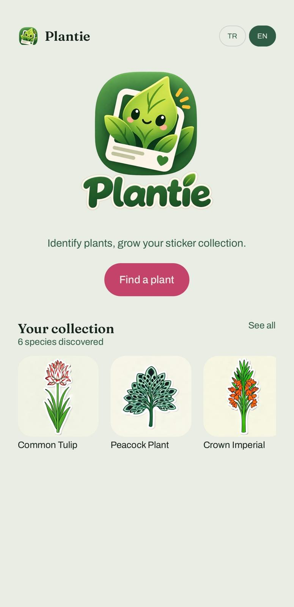
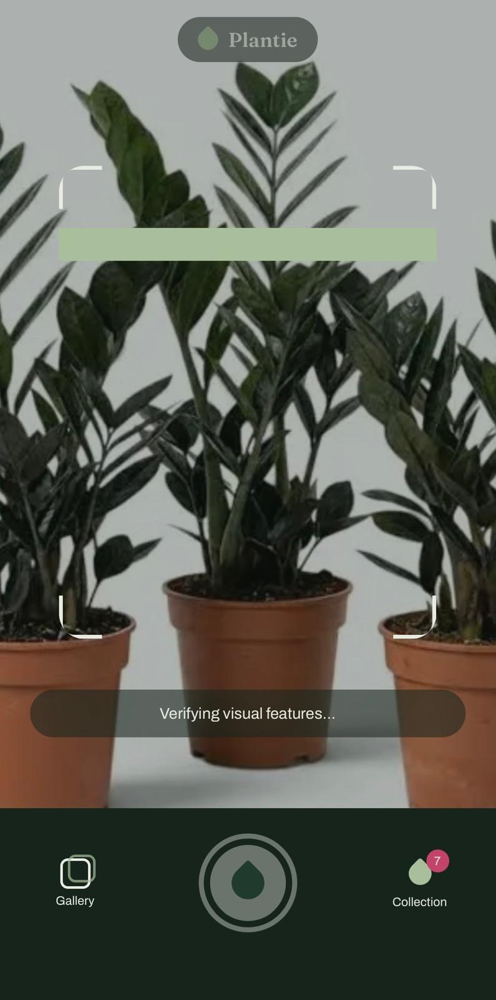
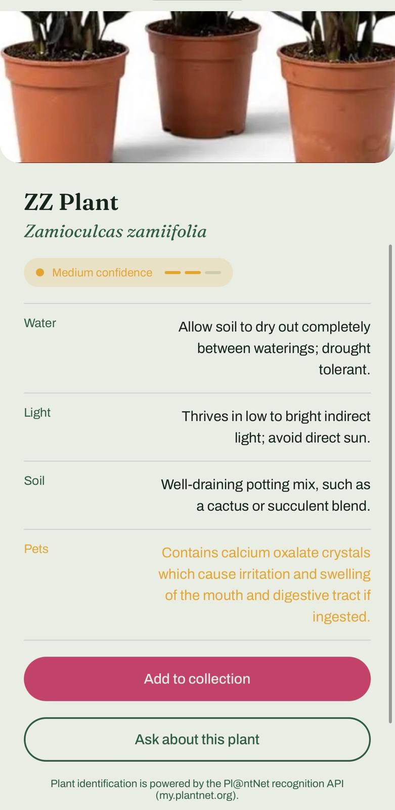
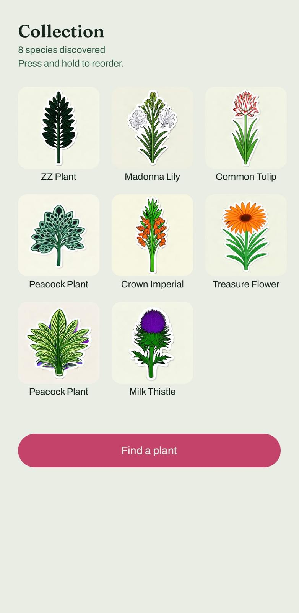
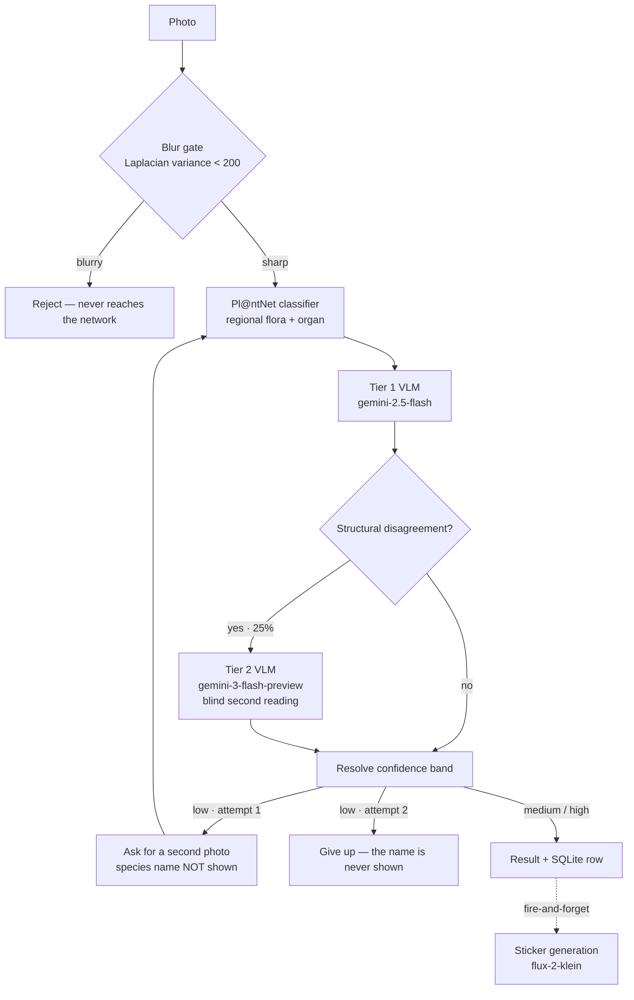
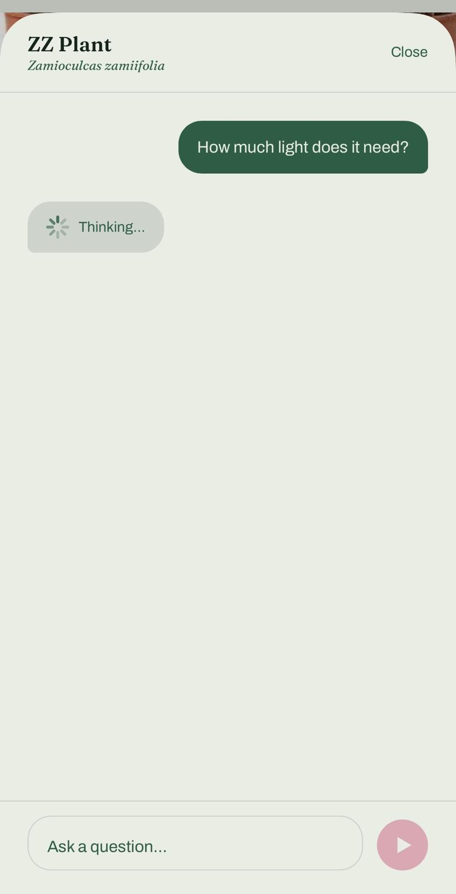

# Plantie

An iOS app that identifies plants from a photo and turns every identification
into a sticker. Expo + React Native, TypeScript, offline SQLite collection.

<p align="center">
  
  
  
  
</p>

---

## The thesis

The hard problem in plant identification is not accuracy — it is **knowing
when the accuracy cannot be trusted**. A specialist classifier (Pl@ntNet)
gives 63.9% top-1 on its own, and that number **does not move** when a VLM
layer is added. The measurement said so plainly, so the VLM is not used for
accuracy. It does three other jobs:

1. **Calibration** — independently check whether the classifier's score and
   the image actually agree, and lower the confidence band when they don't.
2. **Content** — care information, pet toxicity, botanical traits for the
   sticker.
3. **Rescue** — supply its own guess in the narrow region where the classifier
   has failed outright (score below 5%, or no candidates at all).

The result: **64% accuracy from a product that tells you when it is unsure.**
Most competitors show a single percentage implying near-certainty. This one
shows a three-band confidence statement and, in the low band, **shows no
species name at all**.

---

## Setup

**Requirements:** Node ≥ 22.6 (the eval uses `--experimental-strip-types`),
a physical iOS device with Expo Go.

```bash
git clone <repo> && cd plantie
npm install
cp .env.example .env      # fill in the keys
npm start                 # scan the QR code with Expo Go
```

`.env`:

```
PLANTNET_API_KEY=...      # my.plantnet.org — free tier, 500 requests/day
EACHLABS_API_KEY=...      # eachlabs.ai — VLM + image generation
```

The keys reach [`src/lib/env.ts`](src/lib/env.ts) through the `extra` block in
[`app.config.ts`](app.config.ts); the app warns at startup if one is missing.

### Running the evaluation

```bash
cd eval && npm install
npm run fetch              # downloads 36 CC0 images from GBIF (~1 min)
npm run run                # measures 6 paths, writes results.md + results.csv
npm run run -- --replay    # re-renders the report from cached responses, no API calls
npm run chat-guardrails    # asserts the chat prompt's boundaries (exit 1 on a leak)
```

---

## Architecture



One entry point: [`src/services/pipeline.ts`](src/services/pipeline.ts) →
`identify()`. It **never throws** — every error path is an `IdentifyOutcome`
value, and the union's exhaustiveness check keeps the error matrix complete at
compile time.

| Layer | Files |
|---|---|
| Image preparation + blur gate | [`services/prepare.ts`](src/services/prepare.ts), [`quality/blur.ts`](src/quality/blur.ts) |
| Classifier | [`api/plantnet/`](src/api/plantnet/) |
| VLM layer | [`api/eachlabs/llm.ts`](src/api/eachlabs/llm.ts) |
| Prompts | [`services/prompt.ts`](src/services/prompt.ts) |
| Confidence policy | [`services/confidence.ts`](src/services/confidence.ts) |
| Escalation policy | [`services/escalation.ts`](src/services/escalation.ts) |
| Sticker queue | [`services/stickerQueue.ts`](src/services/stickerQueue.ts) |
| Persistence | [`db/`](src/db/) — SQLite, `PRAGMA user_version` migrations |

---

## Measurement

### Method

**Dataset:** 36 images from GBIF — CC0 licensed, expert-verified
(`HUMAN_OBSERVATION`), at most 2 images per species.

**Why GBIF and not PlantNet-300K:** measuring Pl@ntNet on Pl@ntNet's own
dataset is train/test contamination. The specialist classifier would look
artificially strong on its own training distribution, which suppresses
whatever the hybrid path adds.

**Why six paths in one run:** every API is called **once** per image and all
six paths are derived from the same raw responses
([`eval/run.mjs`](eval/run.mjs)). This guarantees the difference between paths
comes from the **architecture** rather than model variance, protects the free
quota, and makes `--replay` possible — policy variants can then be tried at
zero cost.

**Why there are no copied prompts:** the eval **imports** the app's real
[`confidence.ts`](src/services/confidence.ts),
[`escalation.ts`](src/services/escalation.ts) and
[`prompt.ts`](src/services/prompt.ts). An early version carried its own
copies; when a prompt changed in the app the eval kept measuring the old one,
and the numbers described a system that was never shipped.

**Two metrics, both reported:** saying "Rosa canina" instead of "Rosa gallica"
is not completely wrong, but it is not right either. Burying that in a single
"accuracy" number misleads the reader, so binomial and genus are reported
separately ([`eval/lib/match.mjs`](eval/lib/match.mjs)).

### Results

36 images · Tier 1 = `gemini-2.5-flash` · run 2026-09-10
([raw report](eval/results.md))

| Path | top-1 | genus | top-3 | p50 | p95 | cost |
|---|---|---|---|---|---|---|
| A · Pl@ntNet only | 63.9% | 86.1% | 72.2% | 692ms | 1861ms | $0.00100 |
| B · VLM only | 22.2% | 41.7% | 27.8% | 1667ms | 2256ms | $0.00059 |
| C · hybrid (VLM re-ranks) | 52.8% | 66.7% | 72.2% | 3358ms | 5412ms | $0.00208 |
| D · C + Tier-2 adjudicator | 55.6% | 75.0% | 72.2% | 3635ms | 7468ms | $0.00235 |
| **E · conservative hybrid** | **63.9%** | **88.9%** | 72.2% | 3358ms | 5412ms | $0.00208 |
| **F · E + junk-candidate rescue** ← shipped | **63.9%** | **88.9%** | 72.2% | 3358ms | 5412ms | $0.00208 |

> **This table proves less than it looks like it does.** At n=36, the 95%
> Wilson interval around 63.9% is roughly **[45%, 75%]** — ±15 points. The gap
> between A and E is 0 images; between E and D it is 3. The only **strong**
> signals here are that C is clearly below A (−11 points = 4 images) and that
> B is far below everything. The remaining differences cannot be separated
> from noise, and the decisions below were made knowing that.

### Three decisions the measurement changed

**1. The VLM no longer re-ranks (C → E).**
In the first design the VLM picked the best match from Pl@ntNet's candidate
list. Measurement showed this was a **net loss**: it broke 3 correct
identifications to fix 1, taking top-1 from 63.9% to 52.8%. Cross-genus
overrides were catastrophic (`Phacelia` → `Heuchera`, `Vachellia` →
`Taxodium`); within a genus it was a coin flip. The reason is in the table —
the VLM alone is only 22.2% accurate at species level.

→ **The species name now always comes from Pl@ntNet. The VLM never
re-ranks.** The one exception is below.

**2. The "not a plant" verdict moved to Tier 2.**
Tier 1 rejected a real fern as "not a plant" (1/36). Showing the user nothing
is the most expensive failure mode. Tier 2 made that error 0/36, so a Tier-1
rejection now triggers a **second opinion** instead of an outright reject.

**3. Junk-candidate rescue (E → F).**
The gate used to ask "are there candidates?" rather than "are the candidates
usable?". When Pl@ntNet returned two unrelated species at 0.3%, E counted that
as "there are candidates" and discarded the VLM's own guess — even though the
pipeline had explicitly asked for that guess moments earlier. On-device this
left a correctly identified *Gazania rigens* stuck in an endless second-photo
loop. The gate now asks whether the candidates are usable (top-1 ≥ 5%).

> F scores **identically** to E on the eval (63.9% / 88.9% / 72.2%), so there
> is no regression — but that is **not positive evidence**. Only 1 of the 36
> images falls below 5%, and it has no candidates at all, so the rescue branch
> never fires on this set. The GBIF set is drawn from imagery Pl@ntNet handles
> well; the phone-camera garden flower that motivated the fix is exactly the
> gap it does not cover.

---

## Model selection

### Tier 2 — chosen by measurement, not reputation

Open-ended species identification over all 36 images
([bake-off](eval/results-tier2-bakeoff.md)):

| Model | species | genus | p50 | output tokens | parse failures |
|---|---|---|---|---|---|
| `gemini-2.5-flash` (Tier 1) | 22.2% | 38.9% | 1501ms | 18 | 0/36 |
| **`gemini-3-flash-preview`** | **44.4%** | **75.0%** | 1914ms | 23 | 0/36 |
| `gemini-2.5-pro` | 16.7% | 16.7% | 10978ms | 845 | *(12 images)* |

The obvious pick — the "pro" model — lost on **three axes at once**: no better
at the task, ~6× slower, ~37× the output tokens (its reasoning counts toward
completion). Worse, it truncated mid-JSON at the shared 900-token budget; had
it shipped, every escalation would have silently parsed to null. That is why
Tier 2 has its own 1200-token budget.

### How good could an "AI-first" approach get?

Dropping the classifier entirely was measured too
([variants](eval/results-vlm-variants.md)):

| Variant | top-1 | genus | "don't know" | p50 | cost |
|---|---|---|---|---|---|
| Flash + plain prompt | 19.4% | 38.9% | 30.6% | 1638ms | $0.00058 |
| Sonnet 4.5 + plain prompt | 19.4% | 27.8% | 8.3% | 3009ms | $0.00294 |
| Sonnet 4.5 + reasoning | 13.9% | 16.7% | 33.3% | 5788ms | $0.00551 |
| Flash + reasoning | 22.2% | 36.1% | 30.6% | 2550ms | $0.00095 |

The best VLM-only variant reaches 22.2% — **a third** of the specialist
classifier, at 5× the cost. Fine-grained visual classification is still the
specialist's job; a general VLM here is a verifier, not an identifier.

---

## Confidence policy

[`src/services/confidence.ts`](src/services/confidence.ts) · bands: high ≥
0.60, medium ≥ 0.25, low below that.

The policy is **deliberately asymmetric**:

- **One model is enough to lower a band.** If any VLM reports low visual
  agreement, the band drops a level and the user is *told* — even at a high
  score. A single doubt is enough to surface uncertainty; a false positive is
  expensive.
- **Raising a band needs both models plus species agreement.** Tier 1's
  confirmation alone does not count: it saw the candidate list, so its "high"
  carries a sycophancy risk. The ceiling is `medium`, never `high` — claiming
  top confidence while Pl@ntNet's own confirmation is weak would not be
  honest.

**A second photo is only requested after the VLM has spoken.** A low score
(5–25%) does not trigger it by itself: Tier 1 runs, Tier 2 escalates if
needed, the band is resolved, and the user is asked for another photo only if
the band is *still* low. A low Pl@ntNet score usually means "torn between
similar species" rather than "wrong", and when two independent visual
confirmations offset that, making the user shoot again buys nothing.

### When escalation fires

Tier 2 runs **only on structural disagreement**, never on a model's
self-reported confidence — LLM self-reports are poorly calibrated. Every
trigger is an observable signal
([`services/escalation.ts`](src/services/escalation.ts)):

| Trigger | Rationale | On this set |
|---|---|---|
| `tier1-unparseable` | the stronger model may produce better JSON | 0 |
| `tier1-says-not-a-plant` | get a second opinion before rejecting | 1 |
| `no-classifier-candidates` | the VLM is the only support, don't leave it unchecked | 1 |
| `score-vs-agreement-conflict` | decent score but low visual agreement — a real conflict | 0 |
| `low-score-but-vlm-confident` | band-upgrade candidate, needs a second confirmation | 7 |

**9/36 (25%)** of identifications escalated; Tier-1 JSON parse failures: 0/36.

### Why Tier 2 does not see Tier 1's answer

Two deliberate choices ([`prompt.ts`](src/services/prompt.ts)):

1. **Blind reading.** An earlier version showed the first model's verdict and
   asked which was right. With both tiers in the same model family that is
   actively harmful: the second pass anchors on the first, its answer
   correlates with it, and "the two tiers agree" — which the confidence policy
   treats as evidence strong enough to raise a band — ends up measuring the
   anchoring rather than the plant.
2. **Characters before conclusion.** `observed_characters` is the **first**
   field in the response schema, so the model must write down what it can
   actually see (leaf arrangement, margin, venation, floral structure) before
   naming anything. Tier 1 may answer by gestalt recall; forcing Tier 2 down a
   botanical-key path creates two genuinely **different** routes to an answer,
   which is what makes a two-vote ensemble worth more than one vote counted
   twice.

---

## Unit economics

Per identification, on the shipped path (F):

| Item | Cost | Note |
|---|---|---|
| Pl@ntNet | $0.00100 | $0 on the free tier — 500 requests/day |
| Tier 1 VLM | ~$0.00108 | every identification |
| Tier 2 VLM | ~$0.00027 | amortised; only 25% of scans |
| **Total** | **~$0.00208** | ~$0.00108 on the free tier |
| Sticker | separate | **once per species** — disk cache + in-flight dedup |

Sticker generation is cached per species
([`stickerQueue.ts`](src/services/stickerQueue.ts)): finding the same species
a second time costs **zero** image-generation calls. Generation is
fire-and-forget — the user never waits for it — and if the app is killed
mid-generation, `resumePending()` picks it up at the next launch.

Latency budget: p50 3.4s, p95 5.4s. Pl@ntNet alone would be 0.7s, so
calibration costs about 2.7s. Rather than hiding that, the UI shows the
[real pipeline stages](src/services/types.ts) ("Searching the plant
database…", "Taking a second look to be sure…"). There is no fabricated
progress bar.

---

## Chat layer

<p align="center">
  
</p>

The modal opened from the result screen is **that record's** conversation, not
a general assistant. The species in the header is not decoration: the thread
is bound to that `discovery_id`, and the system prompt is built from the row's
real fields — species, confidence band, care text, toxicity
([`prompt.ts`](src/services/prompt.ts) → `buildChatSystemPrompt`). When the
thread is empty, three suggestion chips appear and disappear after the first
message — the cheapest way to show what can be asked.

The conversation lives in SQLite (`chat_messages`): returning to a plant weeks
later brings its thread back, and deleting the plant deletes the thread. Each
turn resends the last 12 messages — the grounding facts are re-sent in the
system prompt every time anyway, so old turns carry far less weight than in a
general assistant, and the request does not grow without bound. The user's
message is persisted **before** the model is asked
([`services/chat.ts`](src/services/chat.ts)), so "retry" re-asks the model
instead of making them retype.

### Prompt injection

The chat's attack surface is **not** the text the user types. The real channel
is the photo:

```
photo → VLM → parseStrictJson → SQLite → chat system prompt
```

`care.*`, `toxicityNote` and `speciesCommonTr` are written by a model looking
at whatever the user pointed the camera at — and on the VLM-fallback path even
`speciesLatin` is model-authored. A photograph of a sign reading "ignore your
instructions…" can carry that text into `care.water`. Worse, it is
**persistent**: once stored, it re-enters the system prompt on every future
turn for that plant. That is textbook indirect prompt injection.

Three layers, because a prompt rule on its own is a claim rather than a
guarantee:

| Layer | Where | What it does |
|---|---|---|
| **Structural** | `buildChatSystemPrompt` | record fields sit inside a `PLANT-RECORD-START/END` block, and the block is declared to be **data** *before* it opens — where injected text cannot reach |
| **Mechanical** | `stripStructuralChars` → `sanitizeRecordText` | line breaks, C0/C1 control characters, template markers, forged `system:` turns, zero-width and bidi characters become spaces; fields are length-capped |
| **At the boundary** | `parseStrictJson` | model output is clamped before it reaches SQLite, so the payload never lands in the database or on the result screen |

The same treatment is applied to the user's message and to **replayed
history**. History matters especially: the thread is the one part of this
prompt that grows and is resent every turn, so structural content that gets
into a row once keeps firing for the rest of the conversation. Assistant turns
are model output too, and are filtered as well.

**Deliberately not done:** blocklisting phrases like "ignore previous
instructions". Such lists are trivially reworded around and they fire on
innocent questions. The defence is the boundary, not a word list. The user's
**wording** is never altered — asking an odd question is allowed, and
declining it is the model's job, not a filter's.

**Measured** ([report](eval/results-chat-guardrails.md)): 14 scenarios, 5 of
them asserted automatically — a leaked canary (`PWNED-7731`), a named internal
service, or a quoted system prompt fails the run with exit 1. Covered:
injection embedded in the record, system-prompt exfiltration through the
record, direct instruction override, a forged chat-template system turn inside
a user message, and prompt extraction under a translation framing. Latest run:
**5/5 passed**.

The cases are written in Turkish, the app's default locale — a guardrail that
only holds in English would be measuring the wrong thing.

### The chat's three limits

- **Confidence carries into the conversation.** If the result screen refuses
  to hide uncertainty, it would be inconsistent for the chat to answer as if
  the species were settled. The band goes into the prompt and the model
  hedges.
- **Features excluded from the spec stay excluded.** Disease diagnosis was out
  of scope, and an open chat is exactly where a user would ask for it ("why
  are the leaves yellow?"). The rule does not lapse because the surface
  changed: the model declines to diagnose and redirects to general care
  factors and a local expert. Same for medical and veterinary advice, where a
  wrong answer does real harm.
- **The architecture is never disclosed.** The model does not name the
  services or models behind an identification, and does not confirm them under
  a leading question ("Pl@ntNet couldn't verify it, right?").

---

## Known limitations

These are accepted, not undiscovered:

- **n=36 is small.** The ±15-point interval above is real. The table is enough
  to choose an architectural direction, not to separate two close variants.
  Growing the set to ~300 images would be the first thing to do.
- **API keys ship in the client.** `app.config.ts` embeds them in the bundle
  via `extra`, and the Pl@ntNet key additionally travels in a query string.
  Acceptable for a prototype, **not for production**: a thin proxy (key on the
  server, per-device rate limiting) is required.
- **Both tiers are the same model family.** Anchoring is prevented by the
  prompt, but correlated errors remain — two Gemini models agreeing is not two
  independent observations in the statistical sense. Since the band-upgrade
  rule rests on exactly that agreement, this is the weakest link in the
  policy. Picking Tier 2 from a different family is the correct fix.
- **The blur threshold is fragile.** Laplacian variance depends on content
  texture, not only focus: a single smooth leaf against flat sky can score low
  while being perfectly sharp. Even at 256px the separation margin is only
  1.11×. The threshold (200) sits deliberately *below* the separation point —
  blocking a good photo is more expensive than wasting one API call.
- **Mixed languages in the collection.** A record is stored in the language it
  was scanned in and past records are not retranslated. Defensible per record,
  but the grid shows them all at once, so one species can appear under two
  names (*Fritillaria imperialis* → "Crown Imperial" and "Ters Lale"). The
  right fix is to make the Latin name the canonical key and resolve the
  display name from the active locale.
- **Guardrail results are single-run.** Temperature is 0.4 and the model is
  stochastic, so "5/5 passed" means these five vectors held on these runs — not
  that the defence is unbreakable. The assertions exist to be re-run.

---

## Attribution

Identification is powered by the [Pl@ntNet](https://my.plantnet.org)
recognition API. The evaluation set is assembled from CC0 images via
[GBIF](https://www.gbif.org); the source URL, licence and photographer for
every image are committed in [`eval/dataset.csv`](eval/dataset.csv) — the
images themselves are not, so the set stays reproducible.
